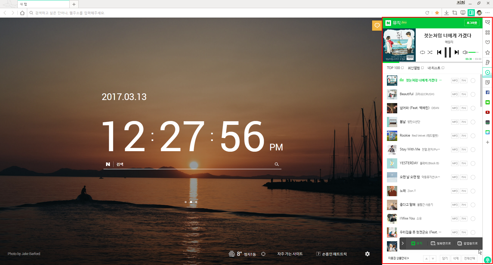

## What are Whale extensions?

Whale extensions are small software programs that enhance the functionality of the Whale browser.

Whale extensions basically share the same architecture with [chrome extensions](https://developer.chrome.com/extensions) and also are compatible with all the [chrome extension APIs](https://developer.chrome.com/extensions/api_index). Instead using the `chrome.*` namespace, Whale extensions provide the `whale.*`namespace to access all the extension features.

```javascript
whale.runtime.XXX
whale.bookmakrs.XXX
whale.browserAction.XXX
whale.windows.XXX
whale.tabs.XXX
whale.storage.XXX
...
```

## Sidebar?

The biggest feature which distinguishes Whale extensions from chrome extensions is the sidebar interface. The sidebar is a set of extension and web panels which slides out from the side of the browser (side depends on setting preference). Users can add various extensions and web panels to sidebars on their own demands.



Sidebar extensions and web panels share the same zone in the Whale browser, but have some differences such as:
  * Web panels are added via browser UI, while sidebar extensions are added via extension installation.


  * Web panels loads web resources from remote servers through HTTP and HTTPS, while sidebar extensions load local resources which are installed from the extension package.

  * Web panels provide navigation menu, with which users can go back and forward while surfing the web.


  * Sidebar extensions use the same navigation menu, but also can be turned on and off via manifest settings.


Finally, the width of the sidebar is adjustable between the range 390 pixels to 590 pixels, if you place the mouse pointer on the boundary of the sidebar.


## What next?
You now know what the Whale extension looks like, how and where it is installed. Now let's have a look at how it is built.

### Files
Each extension has the following files:

* A manifest file
* One or more HTML files (if the extension is sidebar extension, html file is mandatory)
* Optional: One or more JavaScript files
* Optional: Any other files your extension needs—for example, image files

### Sidebar Action
If you wish to build a sidebar extension, you need to declare a sidebar action in the manifest file.
```javascript
{
  ...
  "sidebar_action": {
    "default_icon": {                      // required
      "16": "images/icon16.png"
    },
    "default_page": "popup.html",          // required
    "default_title": "Sidebar Extension",   // optional; shown in tooltip
    "use_navigation_bar": true   // optional; true is default
  }
  ...
}
```
The [whale.sidebarAction](https://github.com/naver/whale-developers/wiki/whale.sidebarAction) interface also provides powerful APIs to control the sidebar extension.

### Chrome extension overview
Finally, the [chrome extension developer's guide](https://developer.chrome.com/extensions/overview) has dozens of additional links to pieces of documentation you might be interested in. You can use the [chrome.* extension APIs](https://developer.chrome.com/extensions/api_index) and [packaging](https://developer.chrome.com/extensions/packaging) specification.

## More to read
* [How to avoid my extension from changing urls](https://github.com/naver/whale-developers/wiki/How-to-avoid-my-extension-from-changing-urls)
* [Client-side-application-vs-Server-side-application](https://github.com/naver/whale-developers/wiki/Client-side-application-vs-Server-side-application)
* [Testing and debugging my extension](https://github.com/naver/whale-developers/wiki/How-to-test-and-debug-my-extension)
* [Registering my whale extension](https://store.whale.naver.com/developers)
